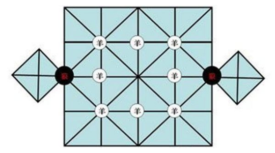
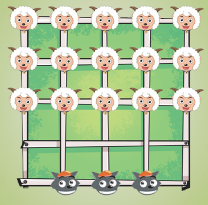

# MyGame
创建四个小游戏：
- 金字塔  

- 扫雷

- 狼吃羊-1  
  [参考](https://zhidao.baidu.com/question/178505794.html)  
    
  （1）先找一块平整光花的地方画好棋盘。棋盘呈正方形，纵横线各5条，加上长短不一的6条斜线交叉成25个点，在正方形的上下还要各画一个菱形，并在菱形内画一十字，形成4个点，俗称狼窝。  
  （2）对弈时，一方持两块大石子当狼，另一方持24块小石子当羊。先在棋盘正中的小正方形各点上摆8个羊，在双耳与大正方形结合点的“狼窝口”各摆一个狼。  
  （3）狼棋子先走，羊棋子后行。狼棋子按路线跳过对方的一只羊，就能吃掉这只羊。整个棋盘线条交错，结构复杂，持狼的一方想方设法占据有利位置，尽可能吃掉更多的羊；而持羊的一方则要四面围堵，尽可能困死狼。
  
- 狼吃羊-2  
  另一个版本的狼吃羊  
  狼空一个可以吃羊（一次走两步），否则只能走一步。  
  羊每次只能走一步。  
  狼吃掉所有羊，狼赢；羊围住所有狼，羊赢；谁都赢不了，平局  
  

- 点羊窝  
  [参考](https://zhidao.baidu.com/question/554756168049508412.html)  
  走羊窝又叫搁羊窝，是邳州的博弈游戏，搁羊窝的棋子为不同颜色或不同形状、不同大小物体，如小石子等；棋盘为六个并排的方格组成，称羊窝。  
  搁羊窝游戏是二人对弈，规则如下：  
  （1）、比赛时，每窝放五个籽作羊，一人抓起一窝羊，顺着一个方向朝每个窝内放一只，放完手中的羊，接着抓起一窝继续放羊，如遇连续的间隔，则可以连续得羊。两人轮流放羊，直到羊放完为止，有时只剩下两只羊，谁也无法得到，就平分剩下的羊，谁得的羊多，谁就取得一回合的胜利。  
  （2）、第二回合各摆放（这窝居于胜方）好棋子继续比赛，赛中负方除按顺序向窝里放羊外，遇到买的窝也要放进一只羊，这叫喂羊，这些羊属于胜方所有，随将得到的羊向自己一边的羊窝放。  
  （3）、负方的羊不够放满六窝（每窝仍为五只羊）就要卖窝，胜方用手中多出来的羊替负方放羊时则不向这窝里放，直到一方的羊窝全部卖完时才算结束。这种博弈游戏简单易行，棋盘可以在地上随手而画，棋子也是就地取材，多为少儿玩耍。  